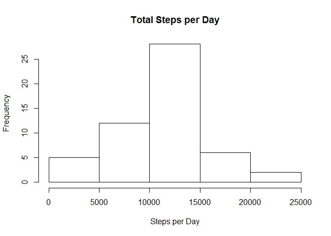
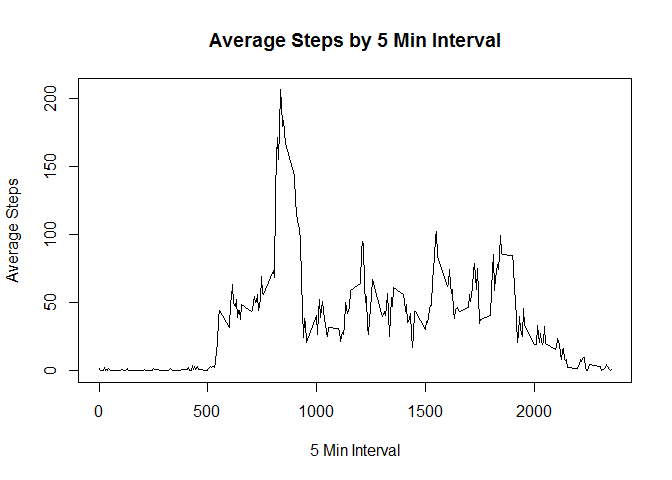
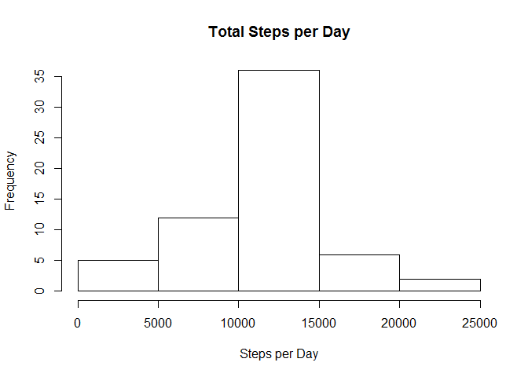
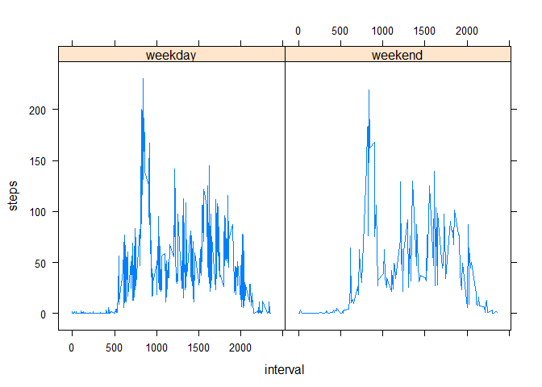

# Reproducible Research: Peer Assessment 1


## Loading and preprocessing the data
Follow these steps to begin.
1. Go to the github repository and download the zip file. 
2. Extract the csv file from the zip file and place it in your working directory.
3. The r code will load the data into activity

```r
activity <- read.csv("activity.csv")
```

## What is mean total number of steps taken per day?
We would like to see a histogram of the total number of steps per day. For this exercise we are ignoring NA values.

```r
stepsperday <- aggregate(activity[,c("steps")], by=list(activity$date), "sum")
hist(stepsperday$x, main = "Total Steps per Day", xlab = "Steps per Day")
```

<!-- -->

The mean for the totals steps by day is (NAs are removed):

```r
mean(stepsperday$x, na.rm = TRUE)
```

```
## [1] 10766.19
```

The median for the totals steps by day is (NAs are removed):

```r
median(stepsperday$x, na.rm = TRUE)
```

```
## [1] 10765
```

## What is the average daily activity pattern?

The timeseries chart will help us explore the average pattern for each time interval. NAs have been removed to streamline the code.

```r
activity1 <- activity[!is.na(activity$steps),]
activity2 <- aggregate( steps~interval, activity1, mean )
plot(activity2$interval, activity2$steps, type = "l", xlab = "5 Min Interval", ylab = "Average Steps", main = "Average Steps by 5 Min Interval")
```

<!-- -->

The interval with the max average steps is pulled. 

```r
maxrow <- activity2[ which(activity2$steps==max(activity2$steps)), ]
print(maxrow)
```

```
##     interval    steps
## 104      835 206.1698
```

## Imputing missing values
There are 2304 missing values in the file. The number of missing values were discovered by taking a subset of the original file that contains only NA rows and then performing a count on the number of rows.

```r
activitymissingNA <- activity[is.na(activity$steps),]
nrow(activitymissingNA)
```

```
## [1] 2304
```

The number of missing values seems significant, therefore we will replace them using the averages for each interval. The data frame containing rows with NA was merged with the averages for each interval. The average interval was then used to replace the NA. The NA file was then merged with the file containing completed rows.

```r
mergedNA <- merge(x = activitymissingNA, y = activity2, by = "interval", all.x = TRUE)
mergedNA <- mergedNA[ , c("steps.y","date", "interval")]
colnames(mergedNA)[1] <- "steps"
library(plyr)
completeactivity <- rbind(mergedNA,activity1)
```


We would like to see a histogram of the total number of steps per day. For this exercise we are ignoring NA values.

```r
stepsperdaycomplete <- aggregate(completeactivity[,c("steps")], by=list(completeactivity$date), "sum")
hist(stepsperdaycomplete$x, main = "Total Steps per Day", xlab = "Steps per Day")
```

<!-- -->

The NA values were replaced with the average interval value. This resulted in the mean daily value with NA and the mean daily value without NA to be the same. The mean for the totals steps by day is:

```r
mean(stepsperdaycomplete$x, na.rm = TRUE)
```

```
## [1] 10766.19
```

The NA values were replaced with the average intervale value. The mean and median were close in the example at the beginning and they became the same after the NA values were replaced with the average. The median for the totals steps by day is:

```r
median(stepsperdaycomplete$x, na.rm = TRUE)
```

```
## [1] 10766.19
```

## Are there differences in activity patterns between weekdays and weekends?

The date was converted from a factor to a date and then a new column was added to specify whether or not the date is a weekday or weekend.

The data were then used to calculate the average and then placed into a panel plot.

```r
library(lattice)
completeactivity$formattedday <- as.Date(as.character((completeactivity$date), format = "%m/%d/%y"))
completeactivity$weekday <- weekdays(completeactivity$formattedday)
daysofweek <- c('Monday', 'Tuesday', 'Wednesday', 'Thursday', 'Friday')
completeactivity$weekdayorweekend <- c('weekend', 'weekday')[(weekdays(completeactivity$formattedday) %in% daysofweek)+1L]

completeactivity2 <- aggregate(completeactivity[,c("steps")], by=list(completeactivity$weekdayorweekend, completeactivity$interval), mean )
colnames(completeactivity2)[1] <- "weekdayorweekend"
colnames(completeactivity2)[2] <- "interval"
colnames(completeactivity2)[3] <- "steps"
xyplot( steps ~ interval | completeactivity$weekdayorweekend, data=completeactivity2, ty="l")
```

<!-- -->
